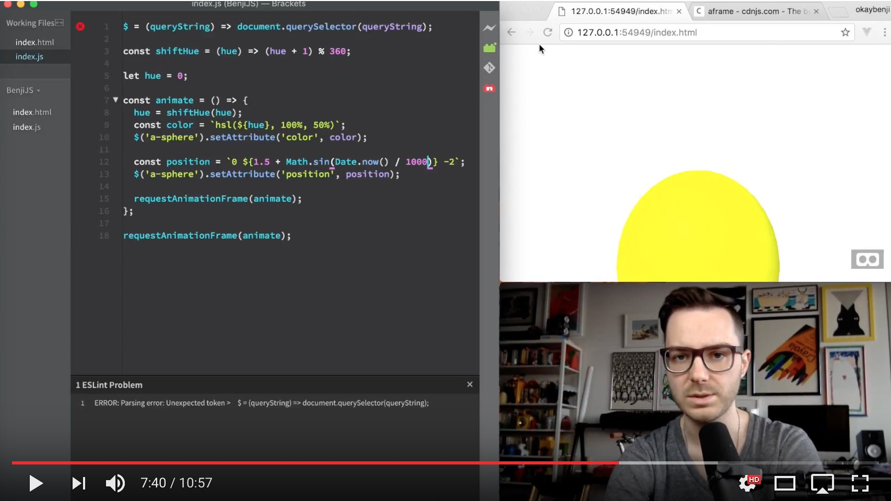

Code from my video tutorial on creating & animating VR scenes with A-Frame.

[Demo](https://okaybenji.github.io/a-frame-demo/)

["Easy WebVR with A-Frame" on YouTube](https://www.youtube.com/watch?v=WgW0SfA5dI0)